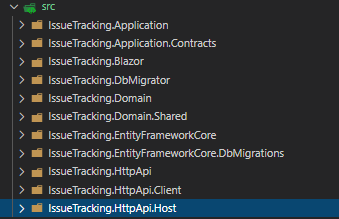

## Implementation: The Big Picture

### Layering of a .NET Solution

The picture below shows a Visual Studio Solution created using the ABP's [application startup template](Startup-Templates/Application.md):

The solution name is `IssueTracking` and it consists of multiple projects. The solution is layered by considering **DDD principles** as well as **development** and **deployment** practicals. The sub sections below explains the projects in the solution;

> Your solution structure may be slightly different if you choose a different UI or Database provider. However, the Domain and Application layers will be same and this is the essential point for the DDD perspective. See the [Application Startup Template](Startup-Templates/Application.md) document if you want to know more about the solution structure.

#### The Domain Layer

The Domain Layer is split into two projects;

* `IssueTracking.Domain` is the **essential domain layer** that contains all the **building blocks** (entities, value objects, domain services, specifications, repository interfaces, etc.) introduced before.
* `IssueTracking.Domain.Shared` is a thin project that contains some types those belong to the Domain Layer, but shared with all other layers. For example, it may contain some constants and `enum`s related to the Domain Objects but need to be **reused by other layers**.

#### The Application Layer

The Application Layer is also split into two projects;

* `IssueTracking.Application.Contracts` contains the application service **interfaces** and the **DTO**s used by these interfaces. This project can be shared by the client applications (including the UI).
* `IssueTracking.Application` is the **essential application layer** that **implements** the interfaces defined in the Contracts project.

#### The Presentation Layer

* `IssueTracking.Web` is an ASP.NET Core MVC / Razor Pages application for this example. This is the only executable application that serves the application and the APIs.

> ABP Framework also supports different kind of UI frameworks including [Angular](UI/Angular/Quick-Start.md) and [Blazor](UI/Blazor/Overall.md). In these cases, the `IssueTracking.Web` doesn't exist in the solution. Instead, an `IssueTracking.HttpApi.Host` application will be in the solution to serve the HTTP APIs as a standalone endpoint to be consumed by the UI applications via HTTP API calls.

#### The Remote Service Layer

* `IssueTracking.HttpApi` project contains HTTP APIs defined by the solution. It typically contains MVC `Controller`s and related models, if available. So, you write your HTTP APIs in this project.

> Most of the time, API Controllers are just wrappers around the Application Services to expose them to the remote clients. Since ABP Framework's [Automatic API Controller System](API/Auto-API-Controllers.md) **automatically configures and exposes your Application Services as API Controllers**, you typically don't create Controllers in this project. However, the startup solution includes it for the cases you need to manually create API controllers.

* `IssueTracking.HttpApi.Client` project is useful when you have a C# application that needs to consume your HTTP APIs. Once the client application references this project, it can directly [inject](Dependency-Injection.md) & use the Application Services. This is possible by the help of the ABP Framework's [Dynamic C# Client API Proxies System](API/Dynamic-CSharp-API-Clients.md).

> There is a Console Application in the `test` folder of the solution, named `IssueTracking.HttpApi.Client.ConsoleTestApp`. It simply uses the `IssueTracking.HttpApi.Client` project to consume the APIs exposed by the application. It is just a demo application and you can safely delete it. You can even delete the `IssueTracking.HttpApi.Client` project if you think that you don't need to them.

#### The Infrastructure Layer

In a DDD implementation, you may have a single Infrastructure project to implement all the abstractions and integrations, or you may have different projects for each dependency.

We suggest a balanced approach; Create separate projects for main infrastructure dependencies (like Entity Framework Core) and a common infrastructure project for other infrastructure.

ABP's startup solution has two projects for the Entity Framework Core integration;

* `IssueTracking.EntityFrameworkCore` is the essential integration package for the EF Core. Your application's `DbContext`, database mappings, implementations of the repositories and other EF Core related stuff are located here.
* `IssueTracking.EntityFrameworkCore.DbMigrations` is a special project to manage the Code First database migrations. There is a separate `DbContext` in this project to track the migrations. You typically don't touch this project much except you need to create a new database migration or add an [application module](Modules/Index.md) that has some database tables and naturally requires to create a new database migration.

> You may wonder why there are two projects for the EF Core. It is mostly related to [modularity](Module-Development-Basics.md). Each module has its own independent `DbContext` and your application has also one `DbContext`. `DbMigrations` project contains a **union** of the modules to track and apply a **single migration path**. While most of the time you don't need to know it, you can see the [EF Core migrations](Entity-Framework-Core-Migrations.md) document for more information. 

#### Other Projects

There is one more project, `IssueTracking.DbMigrator`, that is a simple Console Application that **migrates** the database schema and **[seeds](Data-Seeding.md) the initial** data when you execute it. It is a useful **utility application** that you can use it in development as well as in production environment.

### Dependencies of the Projects in the Solution

The diagram below shows the essential dependencies (project references) between the projects in the solution (`IssueTracking.` part is not shown to be simple)

The projects have been explained before. Now, we can explain the reasons of the dependencies;

* `Domain.Shared` is the project that all other projects directly or indirectly depend on. So, all the types in this project are available to all projects.
* `Domain` only depends on the `Domain.Shared` because it is already a (shared) part of the domain. For example, an `IssueType` enum in the `Domain.Shared` can be used by an `Issue` entity in the `Domain` project.
* `Application.Contracts` depends on the `Domain.Shared`. In this way, you can reuse these types in the DTOs. For example, the same `IssueType` enum in the `Domain.Shared` can be used by a `CreateIssueDto` as a property.
* `Application` depends on the `Application.Contracts` since it implements the Application Service interfaces and uses the DTOs inside it. It also depends on the `Domain` since the Application Services are implemented using the Domain Objects defined inside it.
* `EntityFrameworkCore` depends on the `Domain` since it maps the Domain Objects (entities and value types) to database tables (as it is an ORM) and implements the repository interfaces defined in the `Domain`.
* `HttpApi` depends on the `Application.Contacts` since the Controllers inside it inject and use the Application Service interfaces as explained before.
* `HttpApi.Client` depends on the `Application.Contacts` since it can consume the Application Services as explained before.
* `Web` depends on the `HttpApi` since it serves the HTTP APIs defined inside it. Also, in this way, it indirectly depends on the `Application.Contacts` project to consume the Application Services in the Pages/Components.

#### Dashed Dependencies

When you investigate the solution, you will see two more dependencies shown with the dashed lines in the figure above. `Web` project depends on the `Application` and `EntityFrameworkCore` projects which *theoretically* should not be like that but actually it is.

This is because the `Web` is the final project that runs and hosts the application and the **application needs the implementations of the Application Services and the Repositories** while running.

This design decision potentially allows you to use Entities and EF Core objects in the Presentation Layer which **should be strictly avoided**. However, we find the alternative designs over complicated. Here, two of the alternatives if you want to remove this dependency;

* Convert `Web` project to a razor class library and create a new project, like `Web.Host`, that depends on the `Web`, `Application` and `EntityFrameworkCore` projects and hosts the application. You don't write any UI code here, but use **only for hosting**.
* Remove `Application` and `EntityFrameworkCore` dependencies from the `Web` project and load their assemblies on application initialization. You can use ABP's [Plug-In Modules](PlugIn-Modules.md) system for that purpose.

### Execution Flow a DDD Based Application

The figure below shows a typical request flow for a web application that has been developed based on DDD patterns.

* The request typically begins with a user interaction on the UI (a *use case*) that causes an HTTP request to the server.
* An MVC Controller or a Razor Page Handler in the Presentation Layer (or in the Distributed Services Layer) handles the request and can perform some cross cutting concerns in this stage ([Authorization](Authorization.md), [Validation](Validation.md), [Exception Handling](Exception-Handling.md), etc.). A Controller/Page injects the related Application Service interface and calls its method(s) by sending and receiving DTOs.
* The Application Service uses the Domain Objects (Entities, Repository interfaces, Domain Services, etc.) to implement the *use case*. Application Layer implements some cross cutting concerns (Authorization, Validation, etc.). An Application Service method should be a [Unit Of Work](Unit-Of-Work.md). That means it should be atomic.

Most of the cross cutting concerns are **automatically and conventionally implemented by the ABP Framework** and you typically don't need to write code for them.

### Common Principles

Before going into details, let's see some overall DDD principles;

#### Database Provider / ORM Independence

The domain and the application layers should be ORM / Database Provider agnostic. They should only depend on the Repository interfaces and the Repository interfaces don't use any ORM specific objects.

Here, the main reasons of this principle;

1. To make your domain/application **infrastructure independent** since the infrastructure may change in the future or you may need to support a second database type later.
2. To make your domain/application **focus on the business code** by hiding the infrastructure details behind the repositories.
3. To make your **automated tests** easier since you can mock the repositories in this case.

> As a respect to this principle, none of the projects in the solution has reference to the `EntityFrameworkCore` project, except the startup application.

##### Discussion About the Database Independence Principle

Especially, the **reason 1** deeply effects your domain **object design** (especially, the entity relations) and **application code**. Assume that you are using [Entity Framework Core](Entity-Framework-Core.md) with a relational database. If you are willing to make your application switchable to [MongoDB](MongoDB.md) later, you can't use some very **useful EF Core features**. Examples;

* You can't assume [Change Tracking](https://docs.microsoft.com/en-us/ef/core/querying/tracking) since MongoDB provider can't do it. So, you always need to explicitly update the changed entities.
* You can't use [Navigation Properties](https://docs.microsoft.com/en-us/ef/core/modeling/relationships) (or Collections) to other Aggregates in your entities since this is not possible for a Document Database. See the "Rule: Reference Other Aggregates Only By Id" section for more info.

If you think such features are **important** for you and you **will never stray** from the EF Core, we believe that it is worth **stretching this principle**. We still suggest to use the repository pattern to hide the infrastructure details. But you can assume that you are using EF Core while designing your entity relations and writing your application code. You can even reference to the EF Core NuGet Package from your application layer to be able to directly use the asynchronous LINQ extension methods, like `ToListAsync()` (see the *IQueryable & Async Operations* section in the [Repositories](Repositories.md) document for more info).

#### Presentation Technology Agnostic

The presentation technology (UI Framework) is one of the most changed parts of a real world application. It is very important to design the **Domain and Application Layers** to be completely **unaware** of the presentation technology/framework. This principle is relatively easy to implement and ABP's startup template makes it even easier.

In some cases, you may need to have **duplicate logic** in the application and presentation layers. For example, you may need to duplicate the **validation** and **authorization** checks in both layers. The checks in the UI layer is mostly for **user experience** while checks in the application and domain layers are for **security and data integrity**. That's perfectly normal and necessary.

#### Focus on the State Changes, Not Reporting

DDD focuses on how the domain objects **changes and interactions**; How to create an entity and change its properties by preserving the data **integrity/validity** and implementing the **business rules**.

DDD **ignores reporting** and mass querying. That doesn't mean they are not important. If your application doesn't have fancy dashboards and reports, who would use it? However, reporting is another topic. You typically want to use the full power of the SQL Server or even use a separate data source (like ElasticSearch) for reporting purpose. You will write optimized queries, create indexes and even stored procedures(!). You are free to do all these things as long as you don't infect them into your business logic.

[Previous](../part2/part2-What-Is-Domain-Driven-Design.md) | [Part 4: Implementation - The Building Blocks](../part4/part4-Implementation-The-Building-Blocks.md)