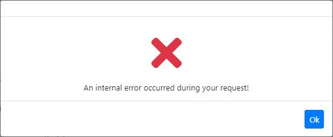
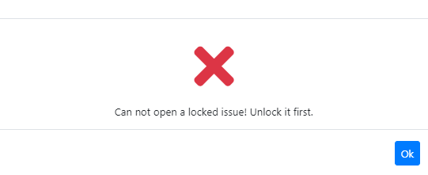

# Exercise 005: Throwing a business exception with code

[< back to theory](../docs/part3/part3-Implementation-The-Building-Blocks.md#theory_exercise_005)

## potential problems of throwing exceptions derived from the Exception class



Above you see the **standard error message** (from exercise 4) thrown by the ABP Framework, 2 potential problems arise:

1. In case of such an exception, should the **end user** see the exception (error) message? If so, how do you **localize** the exception message? You can not use the [localization](https://docs.abp.io/en/abp/latest/Localization) system, because you can't inject and use `IStringLocalizer` in the entities.
2. For a web application or HTTP API, what **HTTP Status Code** should return to the client?

Solution: Create **domain specific exceptions** that inherit from class **BusinessException**.

## Put it into practice

### Checkout branch exercise_005

```bash
git checkout exercise_005
```

### Let's make it work by adding some code

1. Make class **IssueStateException** inherit from **Business Exception**.

    ```csharp
    using Volo.Abp;
    using Volo.Abp;

    namespace IssueTracking.Domain.Issues
    {
      public class IssueStateException : Exception
      {
          public IssueStateException(string code) : base(code)
          {
              
          }
      }
    }
    ```

2. Change the **ReOpen** method in the **Issues** folder of the **Domain** project.

    ```csharp
    public void ReOpen()
    {
      if (IsLocked)
      {
        // business rule 1: A locked issue can not be re-opened.
        throw new IssueStateException("IssueTrackingDomainErrorCodes.YouCannotReOpenALockedIssue");
      }
      IsClosed = false;
      CloseReason = null;
    }
    ```

3. Add a **constant** that specifies a **unique error code** in **IssueTrackingDomainErrorCodes** class in the **Domain.Shared** project.

    ```csharp
    public static class IssueTrackingDomainErrorCodes
    {
      public const string YouCannotReOpenALockedIssue = "IssueTracking:00001";
    }
    ````

4. Add an entry in file **en.json** file in the **Localization/IssueTracking** folder of the **Domain.Shared** project.

   ```json
    "IssueTracking:00001": "Can not open a locked issue! Unlock it first."
   ```

### Run application and Test the Reopen method for an Issue that has been locked

* Delete **database IssueTracking** in **SQL Server** to have a clean start.

* Open a **command prompt** in the **DbMigrator** project and enter `dotnet run` to apply migrations and seed the data.

* Select **ApiDevelopment** in the **dropdown** of the **Debug Window** and run the **HttpApi.Host** project.

* Open a command prompt in the **Blazor** project and enter `dotnet run`.

* Register as a new user and make sure you are logged in. Goto the **Issues** list. Reopening a locked issue should throw a **localized business exception**.



### Stop application

* Stop both the API (by pressing `SHIFT+F5`) and the Blazor project (by pressing `CTRL+C` in the command prompt)

[< back to theory](../docs/part3/part3-Implementation-The-Building-Blocks.md#theory_exercise_005)
